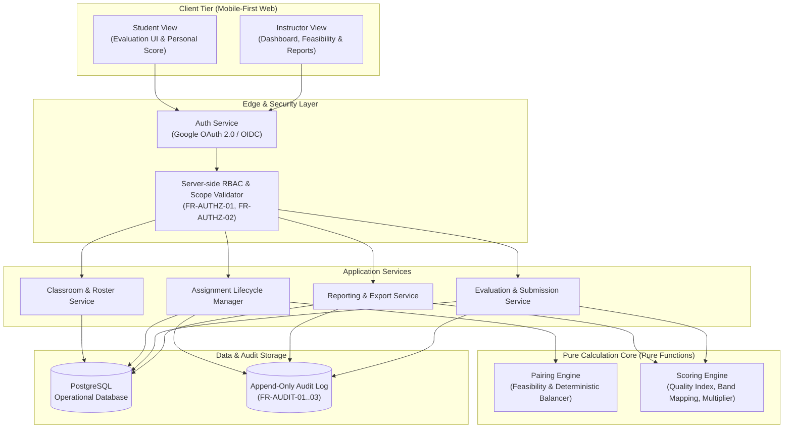

# System Architecture: PairEval

## 1. Architectural Overview

PairEval ถูกออกแบบตามหลักการ **Separation of Concerns** และ **Functional Core, Imperative Shell** โดยแยกส่วนการคำนวณที่ต้องตรวจสอบความถูกต้องทางสถิติ (Pairing & Scoring Engine) ออกมาเป็น **Pure Functions** ที่ไม่มี side-effects หรือ state ภายใน เพื่อให้การคำนวณสามารถทำซ้ำได้ (Reproducible) 100%

## 2. Architectural Principles

- **AR-01 (Pure Function Scoring Core)**: Scoring Engine ต้องเป็น Pure Function ที่รับ input parameters และ comparisons แล้วส่งคืนคะแนนโดยไม่มีการเก็บ state ภายใน ทำให้ audit และ recompute ย้อนหลังได้อย่างเที่ยงตรง
- **AR-02 (Centralized Evaluator Anonymity Layer)**: ทุก query หรือ API endpoint ที่เข้าถึงข้อมูลดิบ ต้องผ่าน Authorization & Anonymization Layer เพื่อป้องกันการรั่วไหลของตัวตนผู้ประเมินไปยังนักศึกษา (FR-ANON-01)
- **AR-03 (Append-Only Audit Log)**: ทุกการกระทำที่มีผลต่อการกำหนดสิทธิ์, การ override คะแนน, การ publish/unpublish และการเข้าถึงตัวตน ต้องถูกบันทึกลงใน storage ที่เป็น append-only โดยไม่มี API ให้แก้ไขหรือลบได้
